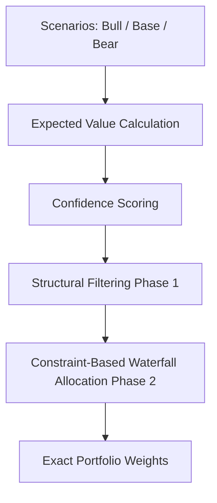

# StrataCore
### Deterministic Portfolio Allocation Engine

 

  <b>StrataCore is a deterministic portfolio allocation engine that converts probabilistic market scenarios into explainable portfolio weights using a constraint-based allocation system.</b>

---

## 📌 How It Works

StrataCore rejects traditional "black-box" approaches like Markowitz mean-variance optimization. Instead, it relies on a strict, pure-math pipeline that guarantees **100% determinism and explainability** for every percentage point allocated.

**The Pipeline:**

---

## 💻 Tech Stack

The architecture focuses on absolute precision and high-performance determinism, exclusively utilizing the `Decimal` library to avoid floating-point drift.

*   **Python** (Core computational engine)
*   **FastAPI** (Async web layer)
*   **Pydantic** (Strict data validation)
*   **PostgreSQL** + **SQLAlchemy** (Persistence)
*   **Pure Math Engine** (No external dependencies like Numpy or Pandas)

---

## 📊 Project Status & Capabilities

Transparent overview of the current development phase:

✅ **Core Engine:** 100% complete. **Engine stress-tested across 20M iterations with deterministic outputs and zero memory leaks.**
✅ **Scaling:** Successfully stress-tested with universes of up to 1,000 algorithmic assets.
✅ **Resilience:** Formal verification against 10,000+ adversarial regimes (logic asphyxiation) with 0 invariant breaches.
🚧 **SaaS Interface:** Partially implemented (Next.js scaffolded, authentication & core dashboard concepts working). 
🚧 **Billing / User Management:** Stripe integration architecture modeled.

---

## 🖼️ Screenshots

*(Replace the placeholder links below with your actual image URLs)*

### 1. The Allocation Dashboard

### 2. Allocation Matrix & Results

### 3. Scenario & Universe Builder

